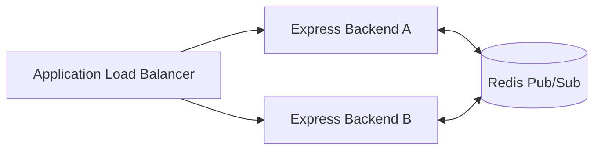

# Technical Decisions, Trade-offs, & Security Architecture

This document details the core architectural decisions, engineering trade-offs, scalability considerations, and security implementation patterns engineered into **HealthDesk**.

---

## 💾 1. Technical Decisions & Trade-offs

### Concurrency Control (Preventing Slot Double-Bookings)

#### Rationale & Decision
In clinical scheduling, multiple users booking the same doctor slot simultaneously is a critical race condition. A naive "Read `isBooked` -> Check -> Save Appointment -> Update Slot" pattern is prone to Time-of-Check to Time-of-Use (TOCTOU) race conditions under high concurrency. 

To resolve this natively and atomically, we query and update the database in a single atomic database operation. In [Slot.ts](file:///c:/Users/jsahu/Desktop/HealthDesk/backend/src/models/Slot.ts), booking validation occurs at the database write boundary:
```typescript
const slot = await Slot.findOneAndUpdate(
  { _id: slotId, isBooked: false },
  { isBooked: true },
  { new: true }
);
if (!slot) {
  throw new ConflictError('This slot is already booked');
}
```

#### Trade-offs & Alternatives
* **The Selected Approach (Atomic single-document write locks)**:
  * **Pros**: Bulletproof protection against double-booking. Runs natively in MongoDB without external cache components. Zero infrastructure overhead or network cost.
  * **Cons**: MongoDB locks the document during the write. High concurrent booking traffic on a single slot could result in write queue latency.
* **Alternative Considered (Redis Distributed Locking)**: Redlock algorithm creates a distributed lock on `lock:slotId` before checking. While it scales horizontally across distinct databases, it introduces extra networking layers, Redis management, and complexity that are unnecessary for a standard clinic operations platform.

---

### Authentication and Session Management (Dual-Token JWT)

#### Rationale & Decision
To secure patient records without sacrificing user experience, we implemented a state-of-the-art **Dual-Token JWT architecture**:
1. **Access Token (Short-lived - 15 minutes)**: Holds authorization payload. Transmitted via the client's memory stack and passed in the `Authorization: Bearer` header.
2. **Refresh Token (Long-lived - 7 days)**: Authorized to request new access tokens. Encapsulated in a secure, `httpOnly`, `sameSite: strict`, and `secure: true` (production only) cookie.

On token expiration, the Axios client interceptor in the frontend automatically calls the token renewal endpoint to refresh the session seamlessly.

#### Trade-offs & Alternatives
* **Pros**:
  * Storing the refresh token in `httpOnly` cookies makes it inaccessible to JavaScript, mitigating Cross-Site Scripting (XSS) extraction attacks.
  * Transmitting the access token in memory avoids CSRF risks for write APIs, as normal API queries do not rely on implicit cookies for authorization.
* **Cons**: Requires active state sync between the backend router middleware and the frontend HTTP engine. It also adds token rotation round-trips every 15 minutes.

---

### Real-Time Notification Persistence

#### Rationale & Decision
We opted to persist notifications to the database ([Notification.ts](file:///c:/Users/jsahu/Desktop/HealthDesk/backend/src/models/Notification.ts)) before dispatching them over the real-time layer ([socket.ts](file:///c:/Users/jsahu/Desktop/HealthDesk/backend/src/config/socket.ts)). This guarantees that notifications are delivered even if a client is offline or has a poor network connection.

#### Trade-offs & Alternatives
* **Pros**: Guaranteed delivery. Offline clients automatically retrieve unread alerts upon their next connection.
* **Cons**: Increases write operations on the database compared to pure socket-in-memory broadcasting. However, for critical healthcare events (like schedule changes), delivery guarantee is prioritized over raw write performance.

---

### HIPAA Auditing Compliance Trails

#### Rationale & Decision
Clinical audits demand strict visibility into who accesses health records. In [auditService.ts](file:///c:/Users/jsahu/Desktop/HealthDesk/backend/src/services/auditService.ts), we route every read request for a prescription (`GET /api/prescriptions/:id`) and PDF download request to write a record to the [AuditLog.ts](file:///c:/Users/jsahu/Desktop/HealthDesk/backend/src/models/AuditLog.ts) collection. This captures the user's role, IP, User-Agent, and resource ID.

#### Trade-offs & Alternatives
* **Pros**: Provides a secure audit trail for healthcare compliance regulations.
* **Cons**: Read requests on sensitive endpoints incur the write latency of saving the audit record. To mitigate this, audit logs are saved asynchronously in the background.

---

### Deployment Containerization (Next.js Standalone)

#### Rationale & Decision
Standard Next.js Docker builds bundle unnecessary `node_modules` and build caches, resulting in large image sizes (~800MB). To optimize this, we set `output: 'standalone'` in [next.config.mjs](file:///c:/Users/jsahu/Desktop/HealthDesk/frontend/next.config.mjs). Next.js output tracing compiles only the necessary source dependencies, producing a minimal `server.js`.

#### Trade-offs & Alternatives
* **Pros**: Cuts the final Docker image footprint to under 90MB. This speeds up deployment times, image transfer speeds, and container startup times in environments like AWS ECS Fargate.
* **Cons**: Static assets (`public` and `.next/static`) must be manually copied in the multi-stage Docker build, but this is handled by our multi-stage Dockerfile configuration.

---

## 📈 2. Scalability Considerations

### Database Optimizations & Indexing
To support high query volume, we index frequently accessed fields in MongoDB:
* **Compound Index on Slots**: An index on `{ doctorId: 1, date: 1, startTime: 1 }` enables fast queries for doctor schedules.
* **Status Indexing**: Querying available slots targets `{ isBooked: 1 }`, optimizing booking searches.
* **Compound User Index**: An index on `{ recipientId: 1, isRead: 1 }` in notifications ensures fast retrieval of unread notifications during login.

### WebSocket Horizontal Scaling
To scale WebSocket connections beyond a single backend server instance, we can configure a **Redis Adapter** (`@socket.io/redis-adapter`). This synchronizes event broadcasts across multiple backend instances running behind an Application Load Balancer (ALB).



### Stateless Application Tier
The backend API service is completely stateless. It does not store user session data in server memory (JWTs are verified cryptographically, and socket connections are tracked per container). This allows the service to scale horizontally in AWS ECS Fargate based on CPU/Memory usage.

---

## 🔒 3. Security Implementation

### OWASP Top 10 Mitigation Matrix

| Security Threat | Implementation Details | Location in Code |
| :--- | :--- | :--- |
| **NoSQL Injection** | `express-mongo-sanitize` strips keys prefixing with `$` or `.` from requests to prevent query injection attacks. | [app.ts](file:///c:/Users/jsahu/Desktop/HealthDesk/backend/src/app.ts) |
| **Cross-Site Scripting (XSS)** | `helmet` middleware configures secure HTTP response headers (e.g., CSP, X-Frame-Options) to prevent script execution. | [app.ts](file:///c:/Users/jsahu/Desktop/HealthDesk/backend/src/app.ts) |
| **Cross-Site Request Forgery (CSRF)** | Access tokens are kept in client memory, meaning they are not automatically attached to requests by the browser. | [ClientWrapper.tsx](file:///c:/Users/jsahu/Desktop/HealthDesk/frontend/src/components/ClientWrapper.tsx) |
| **Brute Force Attacks** | `express-rate-limit` rate limiters restrict authentication attempts to 100 requests per 15-minute window per IP. | [app.ts](file:///c:/Users/jsahu/Desktop/HealthDesk/backend/src/app.ts) |
| **Privilege Escalation** | Role-Based Access Control (RBAC) middleware checks JWT roles server-side on all restricted API routes. | [middleware/auth.ts](file:///c:/Users/jsahu/Desktop/HealthDesk/backend/src/middleware/auth.ts) |

### Cryptographic Security & Password Hashing
All user passwords are encrypted using **bcryptjs** with a salt factor of 10 before saving to the database, protecting user credentials in the event of a database compromise.

### Cookie Configuration for Session Tokens
Refresh token cookies are set with the following security attributes:
* `httpOnly: true` (inaccessible to JavaScript)
* `sameSite: 'strict'` (blocks cross-site transmission)
* `secure: true` (forces TLS transmission, active when `NODE_ENV === 'production'`)
