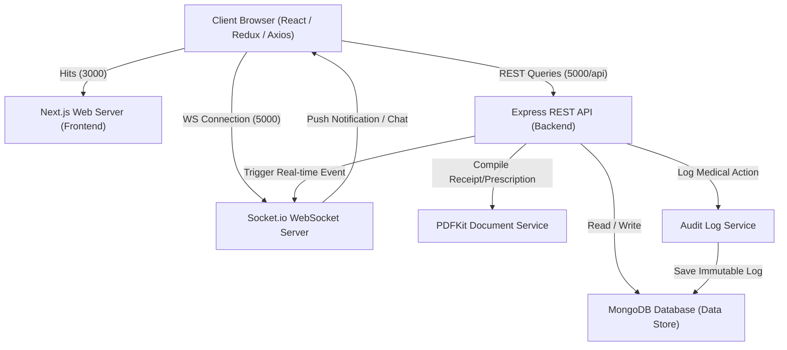

# HealthDesk - Secure Healthcare Management Platform

HealthDesk is a secure, scalable healthcare platform designed for modern clinical operations. Patients can book appointments conflict-free, doctors can manage schedules and write secure prescriptions, and administrators can monitor compliance via an immutable system audit trail.

---

## 🏛️ Architecture Overview

HealthDesk is built on a decoupled **Client-Server architecture** utilizing Next.js for the frontend, Node.js/Express for the backend API, and MongoDB for persistent storage. Real-time updates (such as chat messages and appointment notifications) are handled via a persistent **WebSocket (Socket.io)** connection.

### Core Architecture Flow



### Component Details
* **Frontend Application**: A responsive [Next.js 14](file:///c:/Users/jsahu/Desktop/HealthDesk/frontend/package.json) web interface optimized for rendering patient portals, doctor dashboards, and administrator interfaces. Axios handles REST API communications, featuring a custom interceptor for transparently refreshing expired JWTs. Redux Toolkit maintains overall client-side application state, and Lucide React icons provide rich visual indicators.
* **Backend API Gateway**: A modular [Express](file:///c:/Users/jsahu/Desktop/HealthDesk/backend/package.json) REST API written in TypeScript. It handles JWT-based user authentication, role-based access control (RBAC), and inputs sanitization to enforce strong security boundaries.
* **Real-time Engine**: Powered by [Socket.io](file:///c:/Users/jsahu/Desktop/HealthDesk/backend/src/config/socket.ts). This handles instant chat messages and real-time appointment notices. Connections are verified using JWT headers before allowing users to join individual rooms.
* **Database Engine**: [MongoDB](file:///c:/Users/jsahu/Desktop/HealthDesk/backend/src/config/db.ts) storage for transactional schema objects (users, available slots, scheduled appointments, prescriptions, chat logs). For local development convenience, if a local MongoDB instance is not detected, the system boots up an in-memory database instance automatically.
* **Audit & Security**: Tracks HIPAA-compliant operations (such as reading prescriptions or downloading prescription PDFs) using an immutable database log.

---

## 📁 Project Structure

```text
HealthDesk/
├── backend/                             # Express REST API & WebSockets (TypeScript)
│   ├── src/
│   │   ├── config/                      # Core configurations
│   │   │   ├── db.ts                    # MongoDB connection & in-memory fallback
│   │   │   └── socket.ts                # WebSocket server setup & authentication
│   │   ├── controllers/                 # Business controllers (Auth, Slots, Appointments, Prescriptions)
│   │   ├── middleware/                  # Request pipelines (RBAC, JWT validations, Rate limiters, Sanitizers)
│   │   ├── models/                      # MongoDB Schemas (User, Slot, Appointment, Prescription, AuditLog, Message)
│   │   ├── routes/                      # Router tables mapping routes to controller endpoints
│   │   ├── services/                    # Shared operational services
│   │   │   ├── auditService.ts          # HIPAA audit logging operations
│   │   │   ├── notificationService.ts   # Socket emission & DB notification persistence
│   │   │   └── pdfService.ts            # Medical prescription PDF rendering
│   │   ├── utils/                       # Generic utilities (Winston logger, custom error class list)
│   │   ├── app.ts                       # Express pipeline & middleware config
│   │   └── server.ts                    # Entry-point starting HTTP and WebSocket servers
│   ├── tests/                           # Jest & Supertest integration tests
│   ├── Dockerfile                       # Multi-stage production Docker build
│   └── package.json                     # Backend dependencies & script definitions
├── frontend/                            # Next.js 14 App Router (TypeScript)
│   ├── src/
│   │   ├── app/                         # App Router view folders
│   │   │   ├── admin/                   # Admin portal dashboards
│   │   │   ├── appointments/            # Patient appointment booking & viewing
│   │   │   ├── chat/                    # Doctor-patient text channel UI
│   │   │   ├── doctor/                  # Doctor schedule management interfaces
│   │   │   ├── login/                   # Login UI
│   │   │   ├── prescriptions/           # Prescriptions list & detail viewers
│   │   │   ├── globals.css              # Global custom CSS styles
│   │   │   ├── layout.tsx               # Root HTML layout and providers wrapper
│   │   │   └── page.tsx                 # Core home page layout
│   │   ├── components/                  # Shared user interface components
│   │   ├── hooks/                       # Custom React hooks (e.g. useSocket hook)
│   │   ├── lib/                         # Client utility libraries
│   │   ├── redux/                       # Redux Toolkit store definitions & slice states
│   │   └── services/                    # API services layer & Axios client with token rotation
│   ├── Dockerfile                       # Multi-stage standalone Next.js Docker build
│   └── package.json                     # Frontend dependencies & script definitions
├── aws/                                 # ECS Fargate deployment task definitions
├── docker-compose.yml                   # Production-grade multi-container orchestrator
└── DECISIONS.md                         # Log of architectural decisions and security audits
```

---

## 🛠️ Local Development & Setup

Follow these steps to run a HealthDesk local environment:

### Prerequisites
1. **Node.js**: `v18.x` or `v20.x` installed.
2. **NPM**: Package manager (comes preinstalled with Node.js).
3. **MongoDB** (Optional): A local MongoDB server instance running on `mongodb://localhost:27017`.
   
   > [!TIP]
   > **MongoDB Fallback Feature**: If you do not have MongoDB installed or running, the backend will automatically spin up a self-contained, lightweight in-memory MongoDB Server database (`mongodb-memory-server`) pointing to the local `./backend/dev_db_data` directory. You do not need to install MongoDB to test HealthDesk locally!

### Step 1: Clone and Install Dependencies

1. Install dependencies for the REST API Backend:
   ```bash
   cd backend
   npm install
   ```

2. Install dependencies for the Next.js Frontend:
   ```bash
   cd ../frontend
   npm install
   ```

### Step 2: Configure Environment Files

You must create configuration files inside both the frontend and backend directories. Refer to the [Environment Setup](#-environment-setup) section below for detailed definitions of variables.

1. Create a `.env` file inside `backend/`:
   ```env
   PORT=5000
   MONGO_URI=mongodb://localhost:27017/healthdesk
   JWT_ACCESS_SECRET=your_super_secret_access_token_secret_key_1234567890
   JWT_REFRESH_SECRET=your_super_secret_refresh_token_secret_key_0987654321
   NODE_ENV=development
   CORS_ORIGIN=http://localhost:3000
   ```

2. Create a `.env` file inside `frontend/`:
   ```env
   PORT=3000
   NEXT_PUBLIC_API_URL=http://localhost:5000/api
   NEXT_PUBLIC_SOCKET_URL=http://localhost:5000
   ```

### Step 3: Run the Applications

For development servers supporting Hot Module Replacement (HMR):

1. **Start Backend API & WebSocket Server**:
   ```bash
   cd backend
   npm run dev
   ```
   *The server will run on `http://localhost:5000` (Health Check: `http://localhost:5000/health`).*

2. **Start Next.js Frontend**:
   ```bash
   cd ../frontend
   npm run dev
   ```
   *The portal will open on `http://localhost:3000`.*

---

## ⚙️ Environment Setup

### Backend Config Options (`backend/.env`)

| Variable Name | Default Value | Description | Security Recommendation |
| :--- | :--- | :--- | :--- |
| `PORT` | `5000` | Port for the Express backend API. | Keep unchanged or map appropriately in Docker. |
| `MONGO_URI` | `mongodb://localhost:27017/healthdesk` | MongoDB connection string. | Use Atlas URI with TLS enabled in production. |
| `JWT_ACCESS_SECRET` | *(Random 32-char)* | Secret key to sign short-lived access tokens. | Use a high-entropy string stored in AWS Secret Manager. |
| `JWT_REFRESH_SECRET` | *(Random 32-char)* | Secret key to sign long-lived refresh tokens. | Use a high-entropy string stored in AWS Secret Manager. |
| `NODE_ENV` | `development` | Deployment environment context. | Set to `production` in live deployments. |
| `CORS_ORIGIN` | `http://localhost:3000` | Allowed client origin for CORS headers. | Set to the specific production domain URL. |

### Frontend Config Options (`frontend/.env`)

| Variable Name | Default Value | Description |
| :--- | :--- | :--- |
| `PORT` | `3000` | Port to start the frontend server on. |
| `NEXT_PUBLIC_API_URL` | `http://localhost:5000/api` | The API backend endpoint URL (accessible by client browser). |
| `NEXT_PUBLIC_SOCKET_URL`| `http://localhost:5000` | The WebSocket endpoint URL (accessible by client browser). |

---

## 🧪 Verification & Build Checks

Before checking in code, verify builds and run tests locally:

1. **Type Checking and Production Builds**:
   ```bash
   # Build & compile Backend
   cd backend
   npm run build
 
   # Build & compile Frontend
   cd ../frontend
   npm run build
   ```

2. **Run Backend Integration Tests**:
   ```bash
   cd ../backend
   npm run test
   ```
   *Uses Jest and Supertest in a transaction-isolated in-memory DB context.*

---

## 🐳 Multi-Container Run (Docker)

To run the entire stack locally in a virtualized container environment identical to production:

```bash
docker-compose up --build
```

### Docker Services Exposed
* **Frontend Web App**: `http://localhost:3000` (runs in Next.js lightweight Standalone mode)
* **Backend REST API**: `http://localhost:5000`
* **MongoDB Database**: `mongodb://localhost:27017` (persisted locally to the named Docker volume `mongo-data`)

To teardown the Docker stack and clean up containers:
```bash
docker-compose down -v
```
